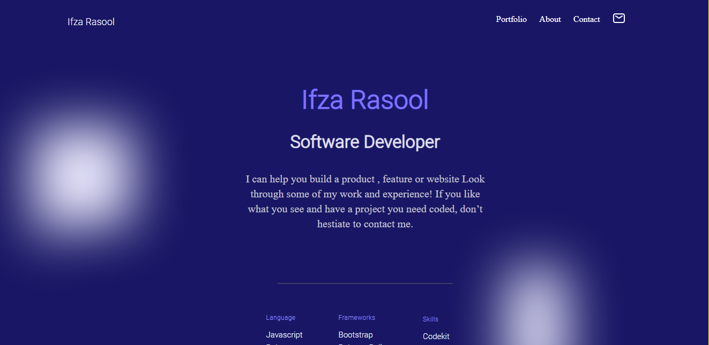

# Portfolio-mobile-version-skeleton

# Project:
# Portfolio-Desktop Version
 Responsive Web Template:

#Build with

# Languages :

 1)HTML  
 2)CSS  
 3)Media Queries  

# Installaion:
1) Linters  
2) npm  
3) webhint  
4) stylelintrc  

 # FrameWork:
 visual studio code/optional

# Tool
Figma

👤 Author

GitHub: @IfzaRasool
Twitter: @IfzaRasool
LinkedIn: Ifza Arain

🤝 Contributing
Contributions, issues, and feature requests are welcome!

Feel free to check the issues page.

# Credits
https://github.com/IfzaRasool/Portfolio-setup-and-mobile-version-skeleton.git
https://css-tricks.com/snippets/css/a-guide-to-flexbox/
https://www.youtube.com/watch?v=bsVHag6qijY&list=PLu8EoSxDXHP7xj_y6NIAhy0wuCd4uVdid&index=7
https://learn.shayhowe.com/html-css/opening-the-box-model/#how-are-elements-displayed

I took help from these link these are very help full.

# Show your support
Give a ⭐️ if you like this project!

# Acknowledgments
Hat tip to anyone whose code was used
Inspiration
etc

📝 # License
This project is MIT licensed.

